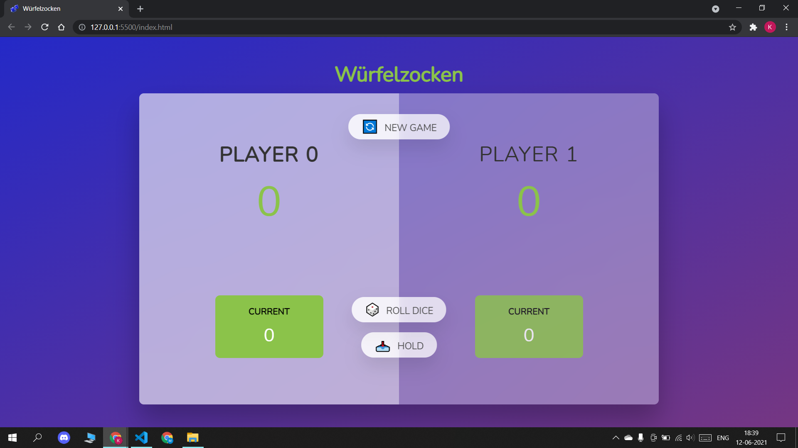
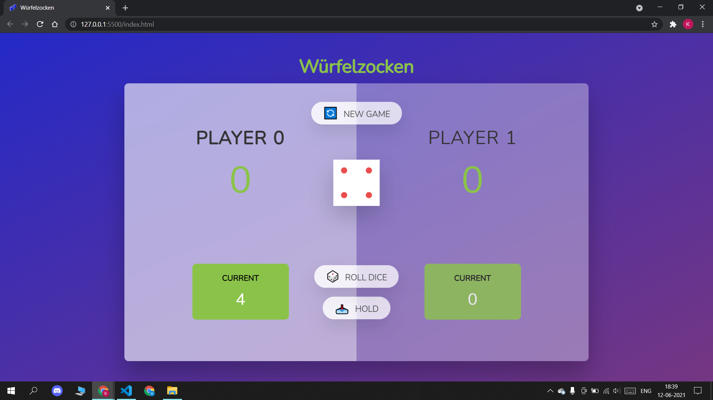
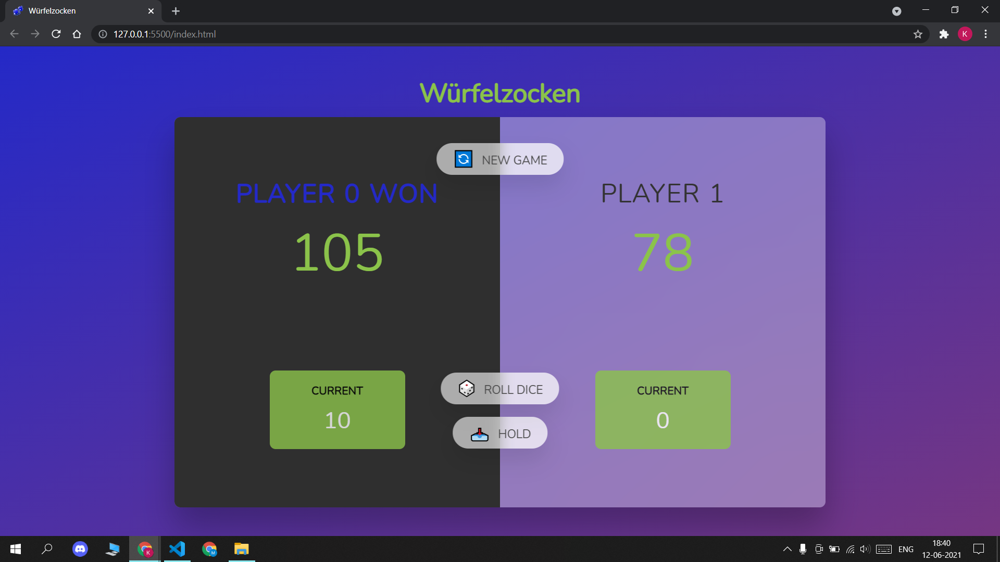

<h2 align="center">Title: Wurfelzocken</h2>
        <h3>A Game of Stratergy and Luck.</h3>
    

    

      A local two player game in which each player will get chance to roll a
      dice. The number on the dice will be added to the current score of that player. The
      player will have an option to roll the dice again or to hold on to the
      current score. Rolling the dice again will come with a risk (i.e. if on
      rolling the dice the number one (1) appears, the current score of the active player will
      reset to 0 and the game will pass on to the other player.) This will
      continue until one of the player scores a century. (100)
    

 
 

 <h2>Enjoy The Game</h2>
    Game Link: https://kanishths.github.io/Wurfelzocken/
     
     
  <h2>Tech Stack Used-</h2>
  

    
    
    
  

 

    
 

